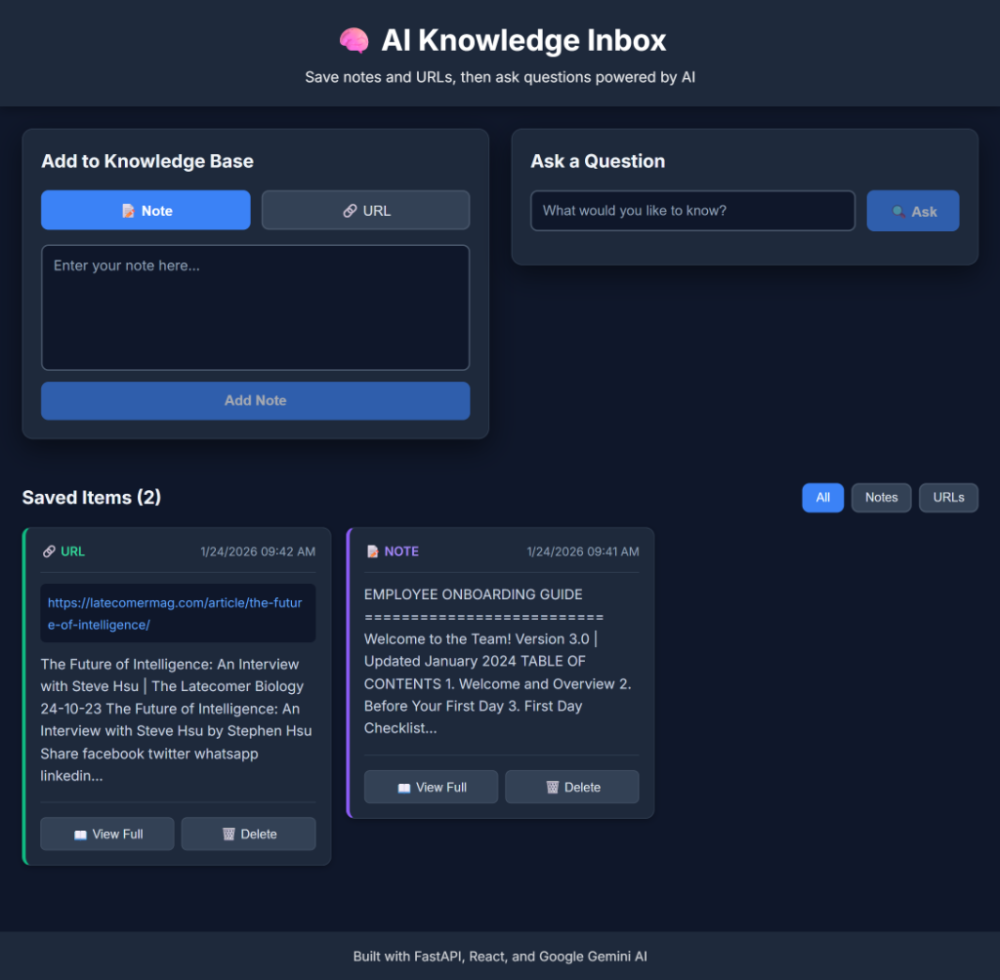
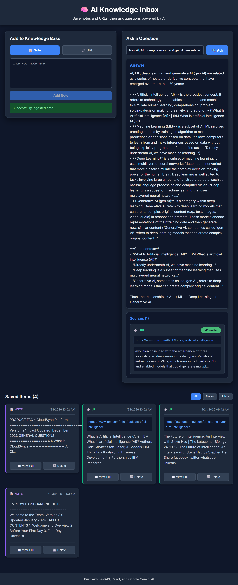

# 🧠 AI Knowledge Inbox

A minimal production-style RAG (Retrieval-Augmented Generation) web application that lets users save notes and URLs, then query them using AI-powered semantic search.

**Live Demo**: Save content → Ask questions → Get AI answers with source citations

---

## 📸 Screenshots

### Application Interface

*Main interface showing content ingestion, saved items, and the query interface*

### Query Results with Sources

*AI-powered answers with source citations and relevance scores*

---

## 🚀 Quick Start

### Prerequisites
- Python 3.8+
- Node.js 18+
- Azure OpenAI API access ([Get started](https://azure.microsoft.com/en-us/products/ai-services/openai-service))

### Installation

1. **Clone the repository**:
```bash
git clone https://github.com/lokeshdeep42/turium_assessment.git
cd turium_assessment
```

2. **Backend setup**:
```bash
cd backend
pip install -r requirements.txt
```

3. **Configure Azure OpenAI**:
```bash
# Create .env file in backend directory
cp .env.example .env

# Edit .env and add your Azure OpenAI credentials:
AZURE_OPENAI_API_KEY=your_api_key_here
AZURE_OPENAI_ENDPOINT=https://your-resource.openai.azure.com/
AZURE_OPENAI_CHAT_DEPLOYMENT=gpt-4
AZURE_OPENAI_EMBEDDING_DEPLOYMENT=text-embedding-ada-002
AZURE_OPENAI_API_VERSION=2024-08-01-preview
```

4. **Frontend setup**:
```bash
cd ../frontend
npm install
```

### Running the Application

**Terminal 1 - Backend**:
```bash
cd backend
python -m uvicorn main:app --reload
```
Backend runs on `http://localhost:8000`

**Terminal 2 - Frontend**:
```bash
cd frontend
npm run dev
```
Frontend runs on `http://localhost:5173`

**Open browser**: Navigate to `http://localhost:5173`

---

## 📖 Features

### Content Ingestion
- **Text Notes**: Save quick notes, meeting summaries, ideas
- **URLs**: Automatically extract and save webpage content
- **Metadata**: Timestamps, source types, automatic chunking

### Semantic Search & RAG
- **Natural Language Queries**: Ask questions in plain English
- **AI-Powered Answers**: GPT-4 generates contextual responses
- **Source Citations**: See which saved items were used (with relevance scores)
- **Smart Chunking**: Content split into searchable segments

### User Interface
- **Add Content**: Simple toggle between notes and URLs
- **Browse Items**: Filter by type (All/Notes/URLs)
- **Item Management**: View full content, delete items
- **Dark Theme**: Modern, clean interface

---

## 🏗️ Architecture

### Tech Stack
- **Backend**: FastAPI (Python)
- **Frontend**: React + Vite
- **Database**: SQLite
- **Vector Store**: In-memory with cosine similarity
- **AI**: Azure OpenAI (GPT-4 + text-embedding-ada-002)

### System Flow
```
User Input → Backend API → Content Processing → Database + Vector Store
                                                         ↓
User Query → Semantic Search → Top Chunks → GPT-4 → Answer + Sources
```

### API Endpoints
- `POST /api/ingest` - Add note or URL
- `GET /api/items` - List saved items (optional filter)
- `GET /api/items/{id}` - Get single item
- `DELETE /api/items/{id}` - Delete item
- `POST /api/query` - Ask question
- `GET /api/health` - Health check

---

## 🎯 Design Decisions & Tradeoffs

### 1. Chunking Strategy
**Choice**: Fixed-size chunks (500 characters, 50 character overlap)

**Rationale**:
- Simple, predictable, low overhead
- Overlap prevents context loss at boundaries
- Works well for both short notes and long articles

**Tradeoffs**:
- May split semantic units (sentences/paragraphs)
- Not adaptive to content structure
- **Production**: Use semantic chunking (LangChain's RecursiveCharacterTextSplitter)

### 2. Vector Store
**Choice**: In-memory with cosine similarity

**Rationale**:
- Zero external dependencies
- Fast for small datasets (<1000 items)
- Reloads from database on startup

**Tradeoffs**:
- Regenerates embeddings on restart (expensive)
- O(n) search complexity
- Single-instance only
- **Production**: Use Pinecone, Weaviate, or Chroma with persistence

### 3. Database
**Choice**: SQLite

**Rationale**:
- Zero configuration, file-based
- Perfect for single-user demo
- Portable, version-controllable

**Tradeoffs**:
- No concurrent writes
- Limited scalability
- **Production**: PostgreSQL with pgvector extension

### 4. AI Provider
**Choice**: Azure OpenAI

**Rationale**:
- Enterprise-grade reliability
- Better quota limits than free tiers
- High-quality embeddings (1536 dimensions)
- GPT-4 for accurate answers

**Tradeoffs**:
- Requires Azure account
- API costs (though minimal for demo)
- **Alternatives**: OpenAI API, Anthropic, or local models (Ollama)

---

## 📊 Scalability Analysis

### Current Capacity
- **Items**: ~1,000 items comfortably
- **Concurrent Users**: ~10
- **Response Time**: <2 seconds

### Breaks At
- **10K+ items**: Memory constraints, search latency
- **100+ users**: Single-threaded bottlenecks
- **Large documents**: URL parsing timeouts

### Production Improvements

**Persistence**:
- Persistent vector DB (Pinecone, Weaviate)
- Cache embeddings in database
- Redis for session/query caching

**Scalability**:
- Async processing (Celery for URL ingestion)
- Horizontal scaling with load balancer
- CDN for frontend assets

**Reliability**:
- Rate limiting (per user/IP)
- Request queuing for LLM calls
- Retry logic with exponential backoff
- Monitoring (Prometheus + Grafana)

**Security**:
- User authentication (JWT/OAuth)
- API key rotation
- Input sanitization
- HTTPS enforcement

---

## 📁 Project Structure

```
turium_assessment/
├── backend/
│   ├── main.py              # FastAPI app entry
│   ├── routes.py            # API endpoints
│   ├── config.py            # Configuration
│   ├── database.py          # SQLite operations
│   ├── vector_store.py      # Vector search
│   ├── rag_pipeline.py      # RAG orchestration
│   ├── ingestion.py         # Content processing
│   ├── models.py            # Pydantic schemas
│   ├── logger.py            # Structured logging
│   └── requirements.txt     # Dependencies
├── frontend/
│   ├── src/
│   │   ├── components/
│   │   │   ├── IngestForm.jsx
│   │   │   ├── ItemsList.jsx
│   │   │   ├── QueryInterface.jsx
│   │   │   └── SourceSnippet.jsx
│   │   ├── services/
│   │   │   └── api.js       # API client
│   │   ├── App.jsx
│   │   └── main.jsx
│   └── package.json
├── .gitignore
└── README.md
```

---

## 🧪 Testing

### Manual Testing Workflow

1. **Ingest Content**:
   - Add a note (e.g., meeting notes, ideas)
   - Add a URL (e.g., article, documentation)

2. **Query Your Knowledge Base**:
   - Ask questions about your saved content
   - Verify AI answers match your sources
   - Check relevance scores on source citations

3. **Manage Items**:
   - Filter by All/Notes/URLs
   - View full content
   - Delete items and verify removal

### Example Test URLs

The following URLs were used to test the application and are shown in the screenshots:

- **AI Overview**: [IBM - What is Artificial Intelligence?](https://www.ibm.com/think/topics/artificial-intelligence)
- **AI Future**: [The Future of Intelligence](https://latecomermag.com/article/the-future-of-intelligence/)

These URLs demonstrate:
- URL content extraction and parsing
- Semantic search across different sources
- AI-generated answers with proper citations

### Sample Queries to Try

After ingesting content, try these queries:
- "What is artificial intelligence?"
- "What are the key trends in AI?"
- "Summarize the main points about [topic from your content]"

### API Testing

Interactive API documentation: `http://localhost:8000/docs`

---

## 🐛 Debugging

### Structured Logging
Backend logs show:
- Request/response details
- Database operations
- Vector store operations
- Error stack traces

### Common Issues

**"Azure OpenAI credentials not set"**:
- Create `backend/.env` file
- Add all required Azure OpenAI variables

**CORS errors**:
- Backend must run on port 8000
- Frontend must run on port 5173 or 3000

**URL extraction fails**:
- Some sites block scrapers
- Try different URLs
- Check backend logs

**Empty answers**:
- Ensure content is ingested first
- Ask more specific questions
- Check if content is relevant

---

## 📝 Code Quality

### Separation of Concerns
- Database layer: `database.py`
- Vector operations: `vector_store.py`
- Business logic: `rag_pipeline.py`, `ingestion.py`
- API layer: `routes.py`
- Configuration: `config.py`

### Error Handling
- Pydantic validation
- Try-catch with specific messages
- Proper HTTP status codes (400, 404, 500)
- Structured logging

### Naming Conventions
- Clear, descriptive names
- Type hints for Python
- Consistent patterns

---

## 📄 License

Created for Turium AI interview assessment.

---

## 🙏 Built With

- [FastAPI](https://fastapi.tiangolo.com/) - Modern Python web framework
- [React](https://react.dev/) - UI library
- [Azure OpenAI](https://azure.microsoft.com/en-us/products/ai-services/openai-service) - AI services
- [Vite](https://vitejs.dev/) - Frontend tooling
